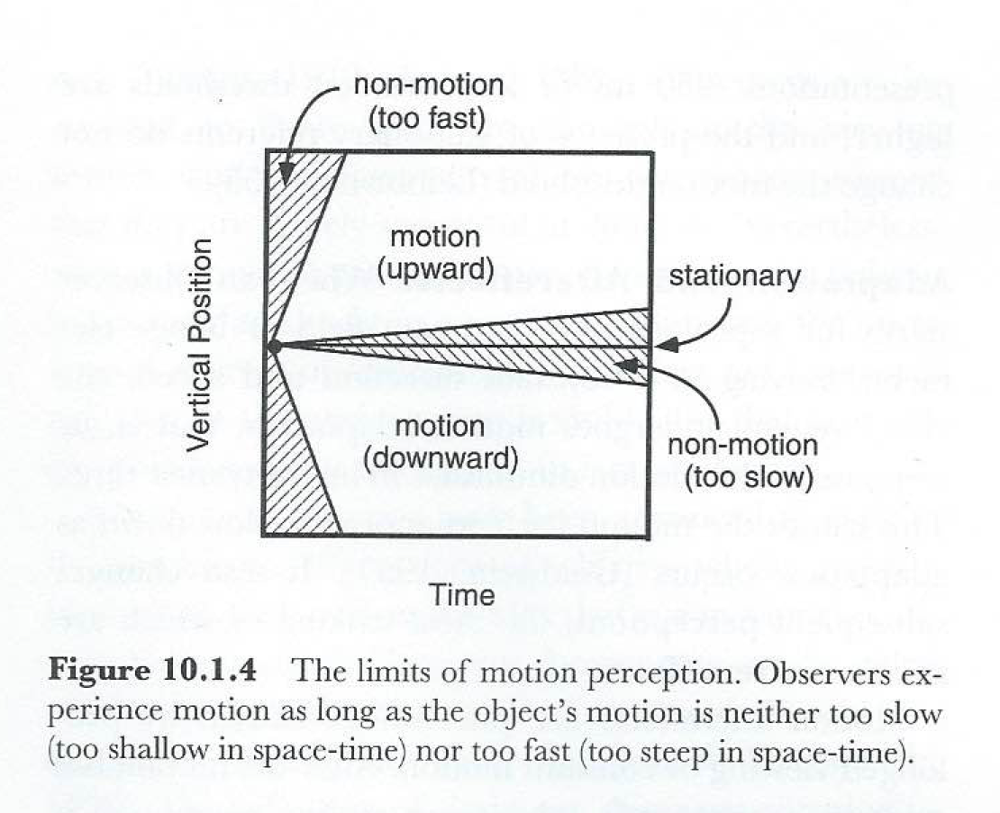

```{r setup, include=FALSE}
options(htmltools.dir.version = FALSE)
library(tidyverse)
library(psyphy)
library(imager)
```

# Today's topics

--
## Motion

---
class: middle, center

## Image motion

## Detecting/computing motion

## Sources and types of motion

---
class: middle, center

# Motion detection

---
class: middle, center

## Motion -> Change in Luminance/Time

## Speed = Distance/Time

## Speed = 

$$\frac{d_2-d_1}{t_2-t_1}$$

---
class: middle, center


<http://www.georgemather.com/Model.html>

## Speed/direction are slopes in space-time [(Adelson & Bergen, 1985)](https://doi.org/10.1364/JOSAA.2.000284)

---
class: middle, center

```{r, echo=FALSE}
x <- 1:100
va <- rep(2.5, length(x))
vb <- x*.03
vc <- sin(4*2*pi*(x/100)) + 1.5
vd <- rep(c(2.5,2.5,2.5,2.5,2.5,.5,.5,.5,.5,.5), 10)
st <- data.frame(xpos = rep(x,4), ypos = c(va, vb, vc, vd), type = rep(c('stationary', 'constant', 'harmonic', 'apparent'), each = 100) )
st %>%
  ggplot(.) +
  aes(x=xpos, y=ypos, color = type) +
  geom_point() + 
  facet_grid(type ~ .) +
  xlab("time") +
  ylab("vpos")
```

---
class: middle, center



# Detection thresholds lie within a range

---
class: middle, center

<p><a href="https://commons.wikimedia.org/wiki/File:Phi_phenomenom_no_watermark.gif#/media/File:Phi_phenomenom_no_watermark.gif"></a><br>By Copied from the very nice animation at <a href="//commons.wikimedia.org/wiki/File:Phi_Phenomenon.gif" title="File:Phi Phenomenon.gif">Image:Phi_Phenomenon.gif</a>, but with the watermark with the image author's name removed in accordance with <a class="external autonumber" href="http://en.wikipedia.org/wiki/WP:IUP#User-created_images">[1]</a> - English Wikipedia The original file was upload by English-Wiki user Cromis, <a href="https://creativecommons.org/licenses/by-sa/3.0" title="Creative Commons Attribution-Share Alike 3.0">CC BY-SA 3.0</a>, <a href="https://commons.wikimedia.org/w/index.php?curid=8051039">Link</a></p>

## Apparent motion

---
class: middle, center

<iframe width="560" height="315" src="https://www.youtube.com/embed/-zbzt7Cb2e4?rel=0" frameborder="0" allow="autoplay; encrypted-media" allowfullscreen></iframe>

## $\phi$ (phi) motion (Wertheimer, 1912)

---
class: middle, center

<iframe width="560" height="315" src="https://www.youtube.com/embed/V8A4qudmsX0?rel=0" frameborder="0" allow="autoplay; encrypted-media" allowfullscreen></iframe>

---
class: middle, center

<iframe width="560" height="315" src="https://www.youtube.com/embed/QOwzkND_ooU?rel=0" frameborder="0" allow="autoplay; encrypted-media" allowfullscreen></iframe>

## Wagon wheel illusion illustrates correspondence problem in apparent motion

---
class: middle, center

<iframe width="560" height="315" src="https://www.youtube.com/embed/lvvcRdwNhGM?rel=0" frameborder="0" allow="autoplay; encrypted-media" allowfullscreen></iframe>

## Motion from static samples smeared in space

---
class: middle, center

<iframe width="560" height="315" src="https://www.youtube.com/embed/VNVmBVHVlmQ?rel=0" frameborder="0" allow="autoplay; encrypted-media" allowfullscreen></iframe>

---
class: middle, center

<iframe width="560" height="315" src="https://www.youtube.com/embed/1cSR3FTQTyc?rel=0" frameborder="0" allow="autoplay; encrypted-media" allowfullscreen></iframe>

## "Strobe" enabled animation

---
class: middle, center

<p><a href="https://commons.wikimedia.org/wiki/File:Aperture_problem_animated.gif#/media/File:Aperture_problem_animated.gif"></a><br>By The original uploader was <a href="https://en.wikipedia.org/wiki/User:Rokers" class="extiw" title="wikipedia:User:Rokers">Rokers</a> at <a href="https://en.wikipedia.org/wiki/" class="extiw" title="wikipedia:">English Wikipedia</a> - Transferred from <span class="plainlinks"><a class="external text" href="//en.wikipedia.org">en.wikipedia</a></span> to Commons., <a href="http://creativecommons.org/licenses/by-sa/3.0/" title="Creative Commons Attribution-Share Alike 3.0">CC BY-SA 3.0</a>, <a href="https://commons.wikimedia.org/w/index.php?curid=1881352">Link</a></p>

## Aperture problem

---
class: middle, center


<http://fourier.eng.hmc.edu/e180/lectures/motion/node11.html>

---
class: middle, center

<iframe width="560" height="315" src="https://www.youtube.com/embed/WhbZesV2GRk?rel=0" frameborder="0" allow="autoplay; encrypted-media" allowfullscreen></iframe>

<https://rmartins.net/demos/ambiguous-and-unambiguous-plaid-motion-stimuli-psychophysics-toolbox>

## Plaid motion illustrates motion integration/segregation

---
class: middle, center

# Detecting/computing motion

---
class: middle, center


Palmer 1990, Fig 10.1.1

## Motion as a trajectory in space-time

---
class: middle, center


## [(Werner) Reichardt](https://en.wikipedia.org/wiki/Werner_E._Reichardt) detector

---
class: middle, center


<http://www.georgemather.com/Model.html>

## Motion Energy Filters [(Adelson & Bergen, 1985)](https://doi.org/10.1364/JOSAA.2.000284)

---
class: middle, center

# Sources & Types of Motion

---
class: middle, center

## Source: Object vs. Self

## Direction, speed, type

---
class: middle, center

<iframe width="560" height="315" src="https://www.youtube.com/embed/WWXL8wjGynQ?rel=0" frameborder="0" allow="autoplay; encrypted-media" allowfullscreen></iframe>

## 2D form from motion

---
class: middle, center

<iframe width="560" height="315" src="https://www.youtube.com/embed/Y97Rxck89p8?rel=0" frameborder="0" allow="autoplay; encrypted-media" allowfullscreen></iframe>

## Flipbooks

---
class: middle, center

<iframe width="560" height="315" src="https://www.youtube.com/embed/RdwU28bghbQ" frameborder="0" allow="autoplay; encrypted-media" allowfullscreen></iframe>

## Structure from motion

---
class: middle, center

<iframe width="560" height="315" src="https://www.youtube.com/embed/mkhY5lANs-k?rel=0" frameborder="0" allow="autoplay; encrypted-media" allowfullscreen></iframe>

## Perceived motion can induce 3D perception via kinetic depth effect

---
class: center, middle

<iframe width="560" height="315" src="https://www.youtube.com/embed/bVSaWXqQh0w?rel=0" frameborder="0" allow="autoplay; encrypted-media" allowfullscreen></iframe>

## Motion parallax specifies relative depth

---
class: middle, center

<iframe width="560" height="315" src="https://www.youtube.com/embed/cGIpSHw7evg?rel=0" frameborder="0" allow="autoplay; encrypted-media" allowfullscreen></iframe>

## Optic flow specifies observer motion

---
class: center, middle

<video controls>
  <source src="mov/wilkie-flow.mp4" type="video/mp4">
Your browser does not support the video tag.
</video>

<http://viperlib.york.ac.uk/categories/104-optic-flow/contributions/1596-pureflow-2002?from_preview=true>

---
class: middle, center

<iframe width="560" height="315" src="https://www.youtube.com/embed/4VGVwOmn6bk?rel=0" frameborder="0" allow="autoplay; encrypted-media" allowfullscreen></iframe>

## Binocular motion signals and 3D perception

<!-- --- -->
<!-- class: center, middle -->

<!-- <iframe width="560" height="315" src="https://www.youtube.com/embed/xUcwbjaGGNM?rel=0" frameborder="0" allow="autoplay; encrypted-media" allowfullscreen></iframe> -->

<!-- ## Random dot kinematogram (RDK) motion parameters -->

---
class: middle, center

<iframe width="560" height="315" src="https://www.youtube.com/embed/skZM8XEE9Eo?rel=0" frameborder="0" allow="autoplay; encrypted-media" allowfullscreen></iframe>

## Motion integration

---
class: middle, center

<iframe width="560" height="315" src="https://www.youtube.com/embed/tGJYSIBETho?rel=0" frameborder="0" allow="autoplay; encrypted-media" allowfullscreen></iframe>

## Second-order (changes in contrast, texture, etc.) but not overall luminance

---
class: middle, center


## Relative contrast matters 

---
class: middle, center


## Context effects [Anstis, 2015](https://www.the-scientist.com/?articles.view/articleNo/43036/title/Seeing-Isn-t-Believing/)

---
class: middle, center


## Grouping effects [Anstis, 2015](https://www.the-scientist.com/?articles.view/articleNo/43036/title/Seeing-Isn-t-Believing/)

---
class: middle, center


## Grouping effects [Anstis, 2015](https://www.the-scientist.com/?articles.view/articleNo/43036/title/Seeing-Isn-t-Believing/)

---
class: middle, center

<iframe width="560" height="315" src="https://www.youtube.com/embed/uF4KUmC9L3M?rel=0&amp;start=122" frameborder="0" allow="autoplay; encrypted-media" allowfullscreen></iframe>

## Motion detection, integration

---
class: middle, center

<iframe width="560" height="315" src="https://www.youtube.com/embed/Iw8idyw_N6Q?rel=0" frameborder="0" allow="autoplay; encrypted-media" allowfullscreen></iframe>

## Anomalous motion illusions

---
class: middle, center


<http://viperlib.york.ac.uk/categories/91-eye-movements/contributions/2060-breathing-windows?from_preview=true>

---
class: middle, center

## PsychoPy, <http://www.psychopy.org/>

## Matlab Psychophysics Toolbox, <http://psychtoolbox.org/>

---
class: middle, center, inverse

# Break

---
class: middle, center

Johansson, G. (1973). Visual perception of biological motion and a model for its analysis. *Perception & Psychophysics*, *14*(2), 201–211. Springer-Verlag. Retrieved December 20, 2017, from https://link.springer.com/article/10.3758/BF03212378

---
class: middle, center

<iframe width="560" height="315" src="https://www.youtube.com/embed/1F5ICP9SYLU" frameborder="0" allow="autoplay; encrypted-media" allowfullscreen></iframe>

---
class: middle, center

<iframe width="560" height="315" src="https://www.youtube.com/embed/KT89CQ2nRpo" frameborder="0" allow="autoplay; encrypted-media" allowfullscreen></iframe>

---
class: middle, center

Newsome, W. T., & Paré, E. B. (1988). A selective impairment of motion perception following lesions of the middle temporal visual area (MT). *The Journal of Neuroscience*, *8*(6), 2201–2211. Retrieved March 30, 2015, from https://www.ncbi.nlm.nih.gov/pubmed/3385495

---
class: middle, center


---
class: middle, center


---
class: center, middle

Slides created via the R package [**xaringan**](https://github.com/yihui/xaringan). Rendered HTML and supporting files are pushed to GitHub where GitHub's 'pages' feature is used to host and serve the course website.
