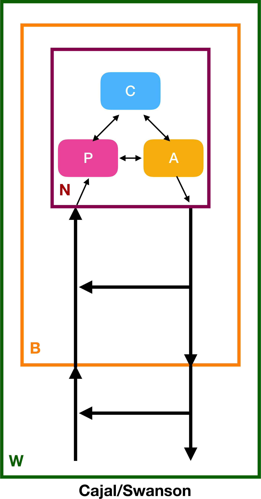

```{r setup, include=FALSE}
options(htmltools.dir.version = FALSE)
library(tidyverse)
library(psyphy)
library(imager)
```
---
class: center, middle

# Prelude

--
## Student presentations start next week (Jackie, Ryan, Sara)

--
## Russ Poldrack talk Wed 4p 108 Wartik


---
class: center, middle

> "*I don’t think we know what ‘attention’ is. It’s a concept that’s so broad and over-used as to be meaningless. There’s lots of things people in psychology and neuroscience study that they call ‘attention’ that are clearly different things.*"

Russ Poldrack

Goldhill, O. (2018, April 7). Psychology will fail if it keeps using ancient words like “attention” and “memory.” *Quartz*. Retrieved April 9, 2018, from https://qz.com/1246898/psychology-will-fail-if-it-keeps-using-ancient-words-like-attention-and-memory/

---
class: center, middle

> "*We need scientific language, not a folk language.*"

Russ Poldrack

---
class: center, middle

# Today's topics

## Perception & Action

---
class: center, middle

Gibson, J. J. (2014). *The Ecological Approach to Visual Perception: Classic Edition*. Psychology Press. Retrieved from https://market.android.com/details?id=book-8BSLBQAAQBAJ, chapters 12-14. | [PDF](pdf/gibson-1979-chaps-12-14.pdf) |.

---
class: center, middle

## Looking with the eyes and head

---
class: center, middle

| Movement type | Traditional view | Gibson's view |
|---------------|------------------|---------------|
| Fixation      | "Pointing at"    | Fixations rare |
| Saccades      | Move target to fovea | Part of scanning sequence |
| Pursuit       | Track moving target | | 
| Vergence      | Related to fixation | Detect match and mismatch |

---
class: center, middle

> "*The function of the retina is to register invariants of structure, not the points of an image.*" 

Gibson 1979, p. 217

---
class: center, middle

> "*A visual fixation is not at all comparable to a snapshot, that is a momentary exposure. The eye has no shutter...The false problems stem from the false analogy between photography and visual perception that everyone has taken for granted...*"

Gibson 1979, p. 220

---
class: middle, center

Costall, A. P. (1984). Are theories of perception necessary? A review of Gibson’s The Ecological Approach to Visual Perception. *Journal of the Experimental Analysis of Behavior*, *41*(1), 109–115. Wiley Online Library. Retrieved from http://dx.doi.org/10.1901/jeab.1984.41-109

---
class: middle, center

> "*The error was to suppose in the first place that perception of the environment is based on a sequence of discrete images. If it is based on invariance in a flow of stimulation, the problem does not arise.*"

Gibson 1979, p. 221

---
class: middle, center

## What is perception for?

---
class: middle, center

### Psychological space is made of up overlapping surfaces.

### We perceive events not time.

### We perceive (directly) the functions that objects serve for action (affordances).

---
class: middle, center

> "*The theory of affordances implies that to see things is to see how to get about amongst them and what to do or not do with them. If this is true, visual perception serves behavior, and behavior is controlled by perception...Moving from place to place is supposed to be 'physical' whereas perceiving is supposed to be 'mental', but this dichotomy is misleading. Not only does it depend on perception but perception depends on locomotion inasmuch as a moving point of observation is necessary for any adequate acquaintance with the enviornment. So we must perceive in order to move, but we must also move in order to perceive.*"

Gibson 1979, p. 223

---
class: middle, center

## Support

## Obtacles vs. openings/apertures

## Direction and speed of self-motion

## Contact with surfaces

## Benefit or injury ahead

---
class: middle, center

# Rules for...

---
class: middle, center

# Visual control of locomotion

---
class: middle, center

## Standing

## Starting, stopping, going back

## Steering

## Approaching

---
class: middle, center

## Entering enclosures

## Keeping a safe distance

---
class: middle, center

# Rules for the visual control of manipulation

---
class: middle, center

## Reaching

## Aiming

## Throwing

## Tool-using...

---
class: middle, center

# A task you care about and study in your research...

---
class: middle, center, inverse

# Break

---
class: middle, center

## What is Gibson's 'beef' with cognitive psychology?

---
class: middle, center

## Can cognitive psychology be fairly characterized by an appeal to "internal, 'mental' rules and representations"?

---
class: middle, center

## In what sense is cognitive psychology "dualist"?

---
class: middle, center

> "*Perceptions are constructed, by complex brain processes, from fleeting fragmentary scraps of data signalled by the senses and drawn from the brain's memory banks themselves snippets from the past. On this view, normal everyday perceptions are not part of-or so directly related to-the world of external objects as we believe by common sense. On this view all perceptions are essentially fictions; fictions based on past experience selected by present sensory data. (Gregory, 1974, p. xviii)*"

Costall, 1984, pp. 110

---
class: middle, center

## Is perception illusory, fictional?

---
class: middle, center

## Is the environment full -- and must be 'filtered' -- or is the environment full because it offers perceivers many possibilities for action?

---
class: middle, center

## Organisms exist within the environment not outside it.

---
class: middle, center

> "*This view of environment as causally prior to, and ontologically independent of, organisms is the surfacing in evolutionary theory of the underlying Cartesian structure of our world view. The world is divided into causes and effects, the external and the internal, environments and the organisms they 'contain'. While this structure is fine for clocks, since mainspring move the hands and not vice versa, it creates indissoluble contradictions when taken as the meta-model of the living world.*"

Richard Lewontin (1982) quoted in Costall (1984, p. 113)

---
class: middle, center

# Does vision science/cognitive science need behavior?

---
class: middle, center

Krakauer, J. W., Ghazanfar, A. A., Gomez-Marin, A., MacIver, M. A., & Poeppel, D. (2017). Neuroscience Needs Behavior: Correcting a Reductionist Bias. *Neuron*, *93*(3), 480–490. Retrieved from http://dx.doi.org/10.1016/j.neuron.2016.12.041

---
class: middle, center


---
class: middle, center


---
class: middle, center


---
class: middle, center


---
class: middle, center



---
class: center, middle

Slides created via the R package [**xaringan**](https://github.com/yihui/xaringan). Rendered HTML and supporting files are pushed to GitHub where GitHub's 'pages' feature is used to host and serve the course website.
