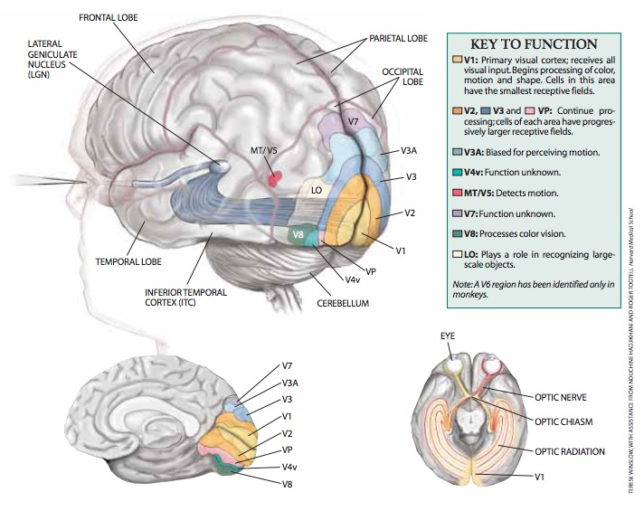

```{r setup, include=FALSE}
options(htmltools.dir.version = FALSE)
```

class: center, middle, inverse
<iframe width="691" height="409" src="https://www.youtube.com/embed/A4QcyW-qTUg" frameborder="0" gesture="media" allow="encrypted-media" allowfullscreen></iframe>

---

background-image: url("http://www.sciencealert.com/images/2017-12/178-curvature-blindness-illusion-1.jpg")
background-position: 50% 50%
class: center, bottom, inverse

---

background-image: url("http://www.sciencealert.com/images/Illusion1.jpg")
background-position: 50% 50%
class: center, bottom, inverse

---
class: center, middle

# PSY 525 Vision Science


---

# Today's topics

--

## Introduction to the course

--

## An introduction to vision science

--

## Discussion of Barlow

---
class: inverse, center,  middle

# Introduction to the course

---

## Resources

### Text

Palmer, S. E. (1999). *Vision Science: Photons to Phenomenology*. MIT Press. Retrieved from https://books.google.com/books?id=mNrxCwAAQBAJ.</br></br>


### Website

<http://psu-psychology.github.io/psy-525-vision-2018/>

---

## Semester schedule

<http://psu-psychology.github.io/psy-525-vision-2018/schedule.html>

## Typical class

### 1st 75 min: lecture/tutorial

### Break

### 2nd 75 min: discussion

---

## Evaluation

| Component           | Points                       | % of Grade |
|---------------------|------------------------------|------------|
| Class participation | 5 pts/class * 14 weeks = 60  | 60         |
| Term project        | 40 pts                       | 40         |
| **TOTAL**           | **100**                      | **100**    |

---
## Examples

- Build a Raspberry Pi computer for vision science and demo it.
    - e.g., using Google's [AIY](http://www.microcenter.com/product/501552/AIY_VISION_KIT) hardware.
- Write computer code to demonstrate a core idea or phenomenon in vision science.
- Write research proposal for a project in vision science.
- Evaluate a machine learning algorithm applied to some defined class of images or videos.
- Write a critical review of some selection of papers from the vision science literature.
- Write a persuasive piece on the topic "What X scientists should know about vision" where X is some subdiscipline you feel would benefit from knowledge about vision science.
- Carry out and report on a small-scale pilot study on some topic in vision science.
- Plan and carry out a replication study of some paper in vision science.
- Demonstrate and explain a set of compelling visual illusions.


---
class: center, middle

# Questions?

---
class: inverse, center, middle

# An introduction to vision science

---
class: center, middle

## What is perception?

## Properties of light

## Hardware

---
class: center, middle

# What is perception?

---
class: center, middle

# Perception asks...

## What's out there?

--

### Shape/form, color, size, identity

--

## Where is it now?

--

## Where is it moving?

--

## What time of {day, year} is it?

---
class: inverse, center, middle

# Properties of light

---
class: center

# Light is electromagnetic radiation


Human eye responds to ~ 390-700 nm (770 - 430 THz)

---
class: center

# The Sun's emission spectra peaks in the visible portion of the EM band.


---
class: center

# Earth's atmosphere largely transparent to visible EM


---
class: center

# Light illuminates surfaces (point source vs. diffuse/spatially extended)


---
class: center

# Light is transmitted, absorbed, or reflected from surfaces


Surface properties (geometry, materials) affect.

Monochromatic (white, gray, black) surfaces reflect/absorb all visible wavelengths equally.

---
class:center

# Light can be refracted in transmission


Why? Light doesn't always go 186K miles (300 km)/s. Speed a function of wavelength and the propagating material.

---
class: center


---
class: center

# Distal 3D patterns of light form proximal (projective) 2D images


*Perspective* (size scales ~ $1/d$) vs. *orthographic* projection

---
class: center

# Same 3D shape can yield different 2D projections


Is vision an ill-specified "inverse" problem (2D -> 3D)?

---
class: center, middle


Gibson says no, ambient optic array uniquely specifies geometry and observer position & motion.

---
class: center

# Lenses realign light rays through larger apertures


---
class: center

# The virtues of light-based sensation

- Fast (relative to sound/vibration or chemical diffusion)
- Provides information about surface geometry, composition
- Biological materials can detect, emit, alter

---
class: inverse, center, middle

# The hardware of vision

---
class: center


---
class: center

## Eye muscles

<a href="https://en.wikipedia.org/wiki/File:Eyemuscles.png#file">

</a>

---
class: center, middle


| Function | Name | Movement types |
|----------|------|----------------|
| Move the eye | Inferior, superior, medial, & lateral rectus; inferior & superior oblique | [saccades](https://en.wikipedia.org/wiki/Saccade), [pursuit](https://en.wikipedia.org/wiki/Smooth_pursuit), [nystagmus](https://en.wikipedia.org/wiki/Nystagmus), [vergence](https://en.wikipedia.org/wiki/Vergence) |
| Alter pupil diameter | Sphincter pupillae | |
| Change lens thickness | [Ciliary muscle](https://en.wikipedia.org/wiki/Ciliary_muscle) | [accommodation](https://en.wikipedia.org/wiki/Accommodation_(eye)) |

---
class: center
# The visual brain has many sub-components



Logothetis, N. K. (1999). Vision: a window on consciousness. Scientific American, 281(5), 69–75. JSTOR. Retrieved from https://www.ncbi.nlm.nih.gov/pubmed/10920769

---
class: center, middle

<a href="https://doi.org/10.1371/journal.pcbi.1005268">

</a>
Jonas, E., & Kording, K. P. (2017). Could a Neuroscientist Understand a Microprocessor? PLoS computational biology, 13(1), e1005268. Public Library of Science. Retrieved January 3, 2018, from http://journals.plos.org/ploscompbiol/article/file?id=10.1371/journal.pcbi.1005268&type=printable
---
class: center, middle

Visual centers connect to many other areas of the brain in serving behavior.

<a href="http://science.sciencemag.org/content/291/5502/260/F1">

</a>

---
class: center, middle

# Why should X psychologists care about vision?

---
class: center, middle

# Cognitive psychologists...

## Properties of computer-based displays used for experimental tasks

## Relationship between overt (eye movement-based) and covert attention shifts

---
class: center, middle

# Developmental psychologists...

## Vision develops throughout childhood

---
class: center, middle

# Social psychologists...

## Much information about others is communicated visually.

---
class: center, middle

# Clinical psychologists...

## Some conditions may reveal themselves through perceptual characteristics.

---
class: inverse, center, middle

# Break time

---
class: inverse, center, middle

# Discussion of Barlow 1972

---
# What question is Barlow trying to answer?

--
>*"I shall discuss the difficult but challenging problem of the relation between our subjective perceptions and the activity of the nerve cells in our brains..."*

---
class: center, middle

>*"...[Müller's doctrine of specific nerve energies](https://en.wikipedia.org/wiki/Law_of_specific_nerve_energies): the specificity of different sensations stems from the responsiveness of different nerve fibres to different types of stimulus..."*

>*"...sensory nerves usually adapt to a constant stimulus, and therefore signal sudden changes of stimulus energy better than sustained levels..."*

---
class: center, middle

>*"...if the surrounding region is simultaneously stimulated the response of the cell is diminished or completely abolished (Barlow, 1953). This phenomenon is called lateral inhibition, or peripheral suppression, and such a physiological mechanism had already been postulated in order to account for simultaneous brightness and Mach bands (Mach, 1886; Fry, 1948). Thus the physiological experiment was really providing evidence in support of a psychological hypothesis..."*


---
class: center, middle

## Mach bands


---
class: center, middle


---
class: center, middle

>*"two important concepts from the frog's retina: it transmits a map, not of the light intensities at each point of the image, but of the trigger features in the world before the eye, and its main function is not to transduce different luminance levels into different impulse frequencies, but to continue responding invariantly to the same external patterns despite changes of average luminance."*

---
class: center, middle

>*"In the cortex Hubel and Wiesel (1962) found that some of the higher level neurons responded to the same trigger feature over a considerable range of positions. The modality specificity of peripheral neurons indicates how one can, for instance, detect warmth at any point on the body surface, and we now see that the organized pattern specificity of a set of cortical neurons can in the same way produce positional invariance for pattern perception."*

---
class: center, middle

>*"If sensory messages are to be given a prominence proportional to their informational value, mechanisms must exist for reducing the magnitude of representation of patterns which are constantly present, and this is presumably the underlying rationale for adaptive effects"*

---
class: center, middle

>*"Individual nerve cells were formerly thought to be unreliable, idiosyncratic, and incapable of performing complex tasks without acting in concert and thus overcoming their individual errors. This was quite wrong, and we now realise their apparently erratic behaviour was caused by our ignorance, not the neuron's incompetence."*

---
class: center, middle

>*"...a prime function of sensory centres is to code efficiently the patterns of excitation that occur, thus developing a less redundant representation of the environment."*

---
# Barlow's Five Dogmas

1. To understand nervous function one needs to look at interactions at a cellular level, rather than either a more macroscopic or microscopic level, because behaviour depends upon the organized pattern of these intercellular interactions.
2. The sensory system is organized to achieve as complete a representation of the sensory stimulus as possible with the minimum number of active neurons.
3. Trigger features of sensory neurons are matched to redundant patterns of stimulation by experience as well as by developmental processes.
4. Perception corresponds to the activity of a small selection from the very numerous high-level neurons, each of which corresponds to a pattern of external events of the order of complexity of the events symbolized by a word.
5. High impulse frequency in such neurons corresponds to high certainty that the trigger feature is present.

---
class: center, middle

# Next time...

## Methods

---
class: center, middle

Slides created via the R package [**xaringan**](https://github.com/yihui/xaringan). Rendered HTML and supporting files are pushed to GitHub where GitHub's 'pages' feature is used to host and serve the course website.
